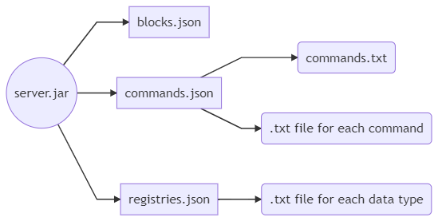
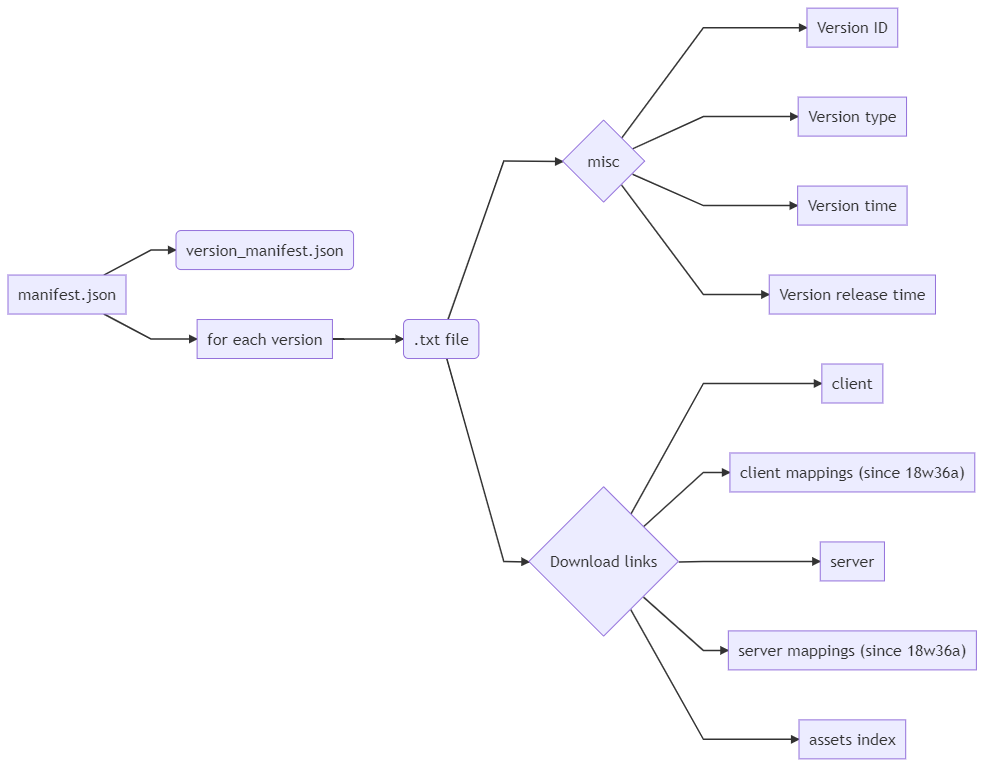

# General informations
Author : PixiGeko  
Original idea by Awhikax, from [DataWorld Discord server](https://discord.gg/3gXea6q ).

# How to extract files
1. Download server.jar of the desired version (from [official site]([https://www.minecraft.net/](https://www.minecraft.net/)) to avoid malware).  You can also find it in this [github](https://github.com/PixiGeko/Minecraft-lists/tree/master/versions/list)
2. Open a bash or command prompt in the directory where server.jar is located
3. run `java -cp server.jar net.minecraft.data.Main --all` (make sure you have Java installed)
  
This will generate the "basic" files ( = rectangles in the diagrams below). 
"Special" files ( = rectangles with rounded corners in the diagrams below) are generated by a personal program.

<i>server.jar download link can be found here : [version_manifest.json](https://launchermeta.mojang.com/mc/game/version_manifest.json) or directly in this [github](https://github.com/PixiGeko/Minecraft-lists/blob/master/versions/version_manifest.json) (might not be up-to-date)</i>

# Files generation

## Data files

### From 18w01a to 18w49a

### Since 18w50a

## Version files
