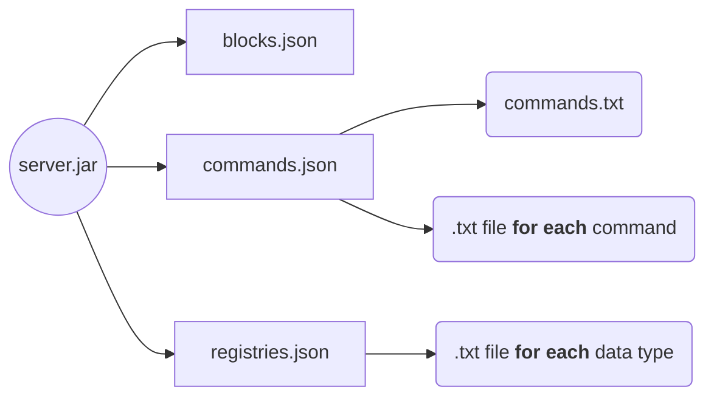

Original idea by Awhikax, from [DataWorld Discord server](https://discord.gg/3gXea6q ).

## How to extract basic files
1. Download server.jar of the desired version (from [official site]([https://www.minecraft.net/](https://www.minecraft.net/)) to avoid malware)
2. Open a bash or command prompt in the directory where server.jar is located
3. run `java -cp server.jar net.minecraft.data.Main --all` (make sure you have Java installed)
  
This will generate the "basic" files (= rectangles in the diagrams below). 
"Special" files (= rectangles with rounded corners in the diagrams below) are generated by a personal program.

<i>server.jar downloads can be found here : [version_manifest.json](https://launchermeta.mojang.com/mc/game/version_manifest.json)</i>

## Files generation

### From 18w01a to 18w49a
<!DOCTYPE html>
<html lang="en">
   <head>
	 
    </head>
	 
<body>
 <pre><code class="language-mermaid">graph LR
A--&gt;B
</code></pre>

graph LR
A((server.jar))

A --> B[blocks.json]
A --> C[commands.json]
A --> D[items.json]

B --> E(blocks.txt)
C --> F(commands.txt)
C --> G(.txt file for each command)
D --> H(items.txt)

	
</body>

</html>

### Since 18w50a

